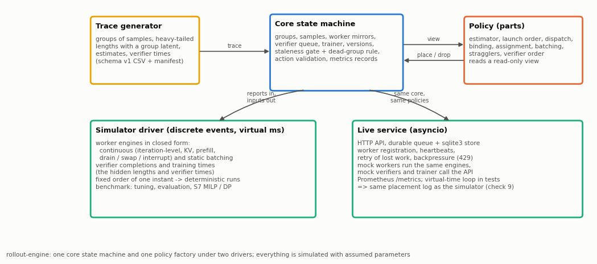
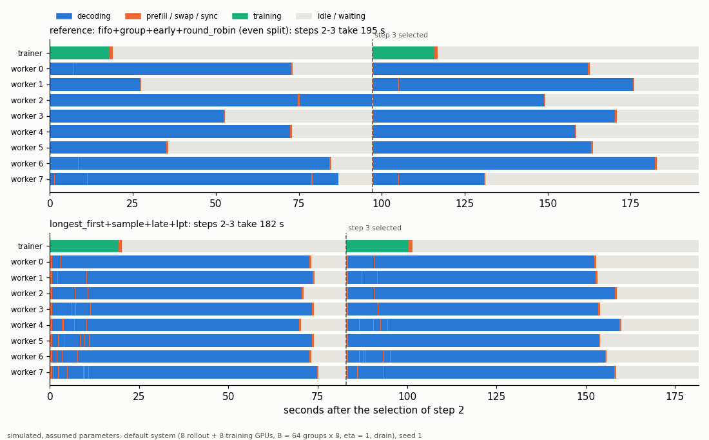
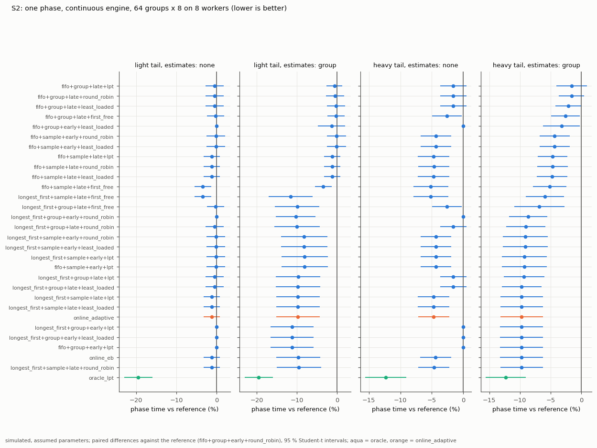
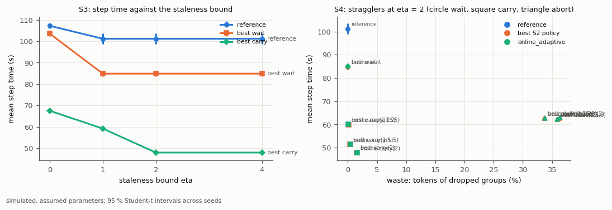
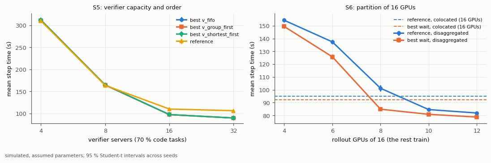
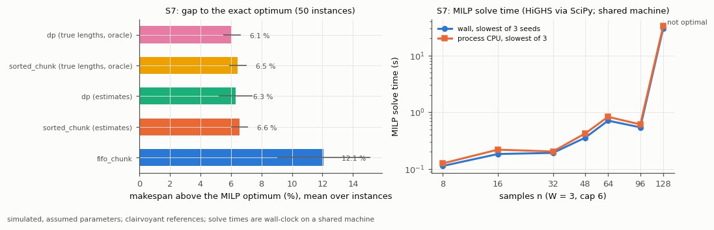
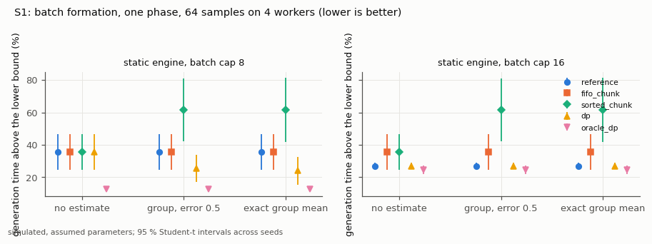
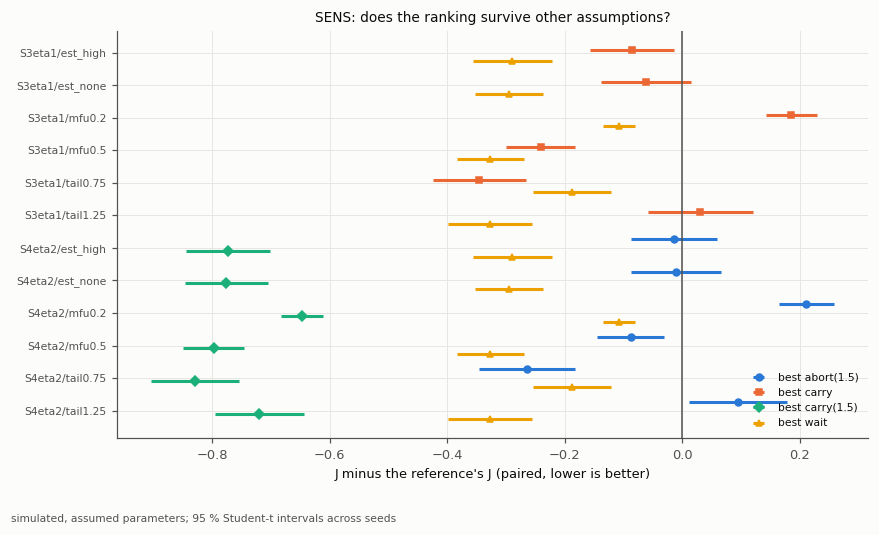
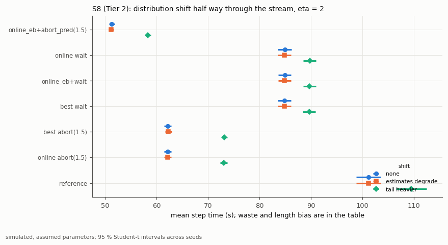
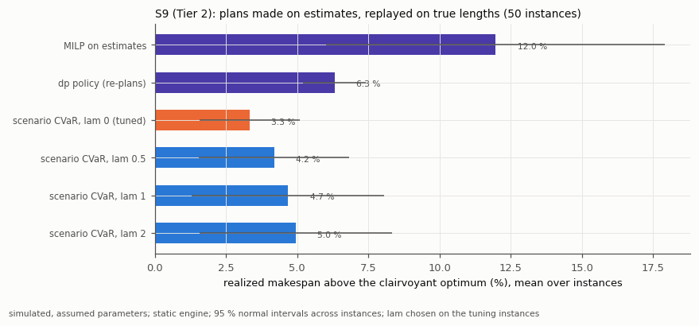

# RL Post-Training Rollout Engine

A deterministic simulator of the rollout side of RL post-training, a benchmark of rollout-scheduling policies on it, and a small live rollout service that runs the same policy code on mock workers.

> **Simulated.** Every scheduling result in this repository comes from a discrete-event simulation with assumed parameters (`docs/simulator.md`); the only measured numbers are wall-clock timings of this code (`wall_*` files: decision costs, solve times, run times) on the development machine. Nothing here measures a GPU, an inference engine, or a training run, and nothing claims anything about production throughput or about learning quality: the simulator has no model of learning, so staleness and length bias are reported as measured quantities only.

**Status:** Tier 1 implemented and tested: the simulator (continuous and static batching engines in closed form, verifier pool, trainer, versions, staleness rules, both partitions), the policy parts and their factory, the exact references (DP, MILP, LPT), the benchmark with frozen tuning and a full evaluation, and the live service (asyncio controller, sqlite3 store, HTTP API, mock workers, Prometheus metrics) that reproduces the simulator exactly on a virtual-time loop. Tier 2: online learning with distribution shift, scenario planning with an optional CVaR term, deadline-aware admission, partition planning, and an optional solver cross-check are done; public length data and GPU calibration are not (see `## TODO`).



## What it is, and what it is not

It is a model of the loop between a trainer and a pool of rollout workers: prompts arrive as groups of samples (as in GRPO), response lengths are heavy-tailed and hidden from the scheduler, workers batch at the iteration level (or statically), a verifier pool checks samples, the trainer consumes batches of groups, publishes new weights, and a staleness bound limits how old the weights behind a consumed sample may be. Scheduling policies decide which groups to launch, where to place their samples, which stragglers to drop, and which sample a free verifier takes next.

It is not a training algorithm (the trainer stays outside the repository), not a replacement for verl, OpenRLHF, or any rollout engine, and not a measurement of any of them.

## Available now

- **Simulator** (`docs/simulator.md`): continuous engine (iteration-level batching with KV reservations, prefix sharing, prefill pauses) evaluated in closed form with integer arithmetic and checked against a step-by-step reference on 2100 random scenarios; static engine; verifier pool checked against Pollaczek-Khinchine, Erlang C, and the Lindley recursion; trainer with sync and publication; `drain`, `swap`, `interrupt` in-flight handling; the staleness gate and the dead-group rule; disaggregated and colocated partitions; metrics over a measurement window; accounting identities checked on every benchmark run.
- **Traces** (`docs/contracts.md`): schema v1 with a loader that names the line of every error, manifests with SHA-256, and a generator (task mix, log-normal lengths with a group latent, estimate models, verifier times, an optional distribution shift).
- **Policies**: estimators (`prior`, `group_evidence`, `eb` with right-censoring, oracle), launch order with an anti-starvation window, group or sample dispatch, early or late binding, assignment (`first_free`, `round_robin`, `least_loaded`, `lpt`), static batch formation (`fifo_chunk`, `sorted_chunk`, `dp`), stragglers (`wait`, `carry`, `abort`, `abort_pred`), deadline-aware admission, verifier order. `reference` is the even static split of a batch across workers (what OpenRLHF does when its engines start a batch empty; verl's agent loop instead routes each sample to the least loaded server).
- **Exact references** (`docs/optimization.md`): the dynamic program over sorted lengths (exact by an exchange argument), the makespan MILP on W workers (SciPy / HiGHS with deterministic limits), LPT with Graham's bounds, brute force for the tests, and a scenario MILP with CVaR.
- **Benchmark** (`benchmarks/README.md`): scenarios S1–S10 and SENS, equal-budget tuning on disjoint seeds, 20 evaluation seeds, Student-t intervals, paired differences, win/tie/loss, manifests.
- **Live service** (`docs/service.md`): asyncio controller on the same core state machine, HTTP/1.1 JSON API (standard library), durable sqlite3 store with an event log and trace export, worker registration, heartbeats and retry of lost work, restart recovery, backpressure, verifier workers, Prometheus `/metrics`, a demo.

## Quick start

Python 3.12. Create the environment once (PowerShell or bash):

```powershell
powershell -ExecutionPolicy Bypass -File scripts\setup_env.ps1
.venv\Scripts\Activate.ps1
```

```bash
bash scripts/setup_env.sh
source .venv/bin/activate
```

(Git Bash on Windows: `source .venv/Scripts/activate`. If PowerShell refuses `Activate.ps1`, call `.venv\Scripts\python.exe` instead of `python` below.) The published repository does not keep executable bits: on Linux and macOS run scripts through `bash` as shown, or `chmod +x scripts/*.sh` once.

Then, the same commands in both shells, from the repository root:

```bash
python -m pytest -q
python -m rollout_engine.bench --quick --workers 4
python -m rollout_engine.service.demo --port 18300
```

`--workers` sets the number of parallel simulation processes (default: half the logical processors); the results here were produced with 4 because the machine was shared. The tests take about a minute; the quick benchmark under a minute on the development machine (4 workers); the demo starts the service on `127.0.0.1:18300`, attaches mock workers, verifiers, and a trainer over HTTP, consumes three training batches, prints them, and exits. One-command check (tests, quick benchmark, demo): `bash scripts/verify.sh` or `powershell -ExecutionPolicy Bypass -File scripts\verify.ps1`.

Full evaluation and figures (`benchmarks/README.md`):

```bash
python -m rollout_engine.bench --workers 4
python -m rollout_engine.bench microbench
python scripts/plot_results.py
python scripts/plot_timeline.py
```

## Results (simulated)

In this simulation, under these assumptions (default system: 8 rollout and 8 training GPUs of an 80 GB class, a 7.6 B model, `B = 64` groups of 8 samples, heavy-tailed lengths with group estimates; `docs/simulator.md`). 20 evaluation seeds (10 for SENS), 95 % Student-t intervals, paired comparisons against the reference (`fifo+group+early+round_robin`, the even static split of a batch across workers). Tuning used disjoint seeds; the tuned configuration was committed before the reported evaluation (commit `3310a8d`), after an earlier evaluation had exposed a flaw in the tuning procedure that was fixed (`benchmarks/README.md`, Results). Full tables: `benchmarks/README.md` and `benchmarks/results/full/tables.md`; every metric of every run: `benchmarks/results/full/`.



*Illustration, not part of the evaluation: one separate 6-step run (seed 1, default system) of the reference and of `longest_first+sample+late+lpt`, GPU states between the selections of steps 2 and 4 (`scripts/plot_timeline.py`).*

- **One phase, continuous engine (S2).** With group-level length estimates and a heavy tail, ordering work by estimated length (launching the longest groups first, or assigning by LPT) shortens the phase by 9.7 % ± 3.5 % against the reference (19 wins, 1 loss over 20 seeds) and brings it from 26 % to 14 % above the lower bound; dispatching single samples with late binding gives the same phase time and lowers GPU idle time further (14 % against 20 % for the same ordering with group dispatch). The oracle that knows every length reaches 11 % above the bound. Without estimates the gain shrinks to 4–5 % (3.4–4.1 s) and comes from dispatching single samples. Under late binding the `round_robin`, `least_loaded`, and `lpt` assignments tie exactly (at most decision instants a single worker can admit), while `first_free` is slower (73.9 s against 70.9 s); `online_adaptive` and the Tier 2 `online_eb`, the same parts with other estimators, give the same phase times.
- **Closed loop (S3).** At `eta = 1` the best S2 policy with `wait` cuts the mean step time from 101.2 s to 84.9 s. Letting groups run on across steps (`carry(rho)`, `rho` tuned per cell between 1.25 and 2) brings it to 59.2 s at `eta = 1`, but a third of the generated tokens then belong to groups that go stale and are dropped (waste 33 %, length bias −24 %: the dropped groups are the long ones); at `eta = 0` carrying has 37 % shorter steps but wastes 43 % of the tokens and loses on J (1.67 against 1.40, 20 of 20 seeds); from `eta = 2` on it costs almost nothing (`carry(2)`: waste 1.5 % at `eta = 2`, none at `eta = 4`; step time 47.9 s). With `swap` or `interrupt` instead of `drain` at `eta = 1`, the reference's step time falls from 101.2 s to 88.9 s / 90.5 s and the share of consumed tokens generated under older weights from 99 % to 61 %.
- **Stragglers (S4, `eta = 2`).** `carry(rho)` beats `abort(rho)` at every `rho`: `carry(2)` reaches 47.9 s with 2 % waste and a mean staleness of 1.19; `abort(1.5)` gets 62.2 s while throwing away 36 % of the generated tokens and biasing the consumed lengths by −25 %. Learning lengths online (`online_adaptive`) changes nothing measurable here.
- **Verifier (S5, 70 % code tasks).** With 4 or 8 verifier servers the trainer waits 88–94 % of the time and the rollout policy no longer matters (step times 164–312 s for every policy); `shortest_first` lowers the mean verifier delay (55.7 s → 42.1 s at 8 servers) without changing the step time.
- **Partition (S6, 16 GPUs).** 12 rollout + 4 training GPUs gives the lowest step time for both policies (78.7 s and 81.9 s); colocated 92.1 s and 94.8 s.
- **Exact references (S7, 50 instances).** `dp` and `sorted_chunk` end 6.3 % and 6.6 % above the MILP optimum, `fifo_chunk` 12.1 %; the lower bound `max(DP / W, cost(1, Lmax))` equals the optimum on 40 of 50 heavy-tailed instances. HiGHS (SciPy 1.13) proves optimality within a second up to 96 samples and hits the 30 s cap at 128 samples on 2 of 3 seeds.
- **Sensitivity (SENS).** The best S2 policy with `wait` beats the reference under every varied assumption (10 of 10 seeds each: tail × 0.75 / × 1.25, no estimates, estimate error 1.0, training MFU 0.2 / 0.5), and `carry(1.5)` at `eta = 2` wins everywhere. `carry` at `eta = 1` loses at MFU 0.2 (0 of 10) and is inconclusive with the heavier tail; `abort(1.5)` wins only with the lighter tail and at MFU 0.5, ties without estimates or with error 1.0, and loses at MFU 0.2 and with the heavier tail.
- **Tier 2.** *Shift (S8):* degrading the estimates half way changes step times by less than 0.3 % (closed-loop step times are insensitive to the estimates, unlike the one-phase S2); a heavier tail lengthens the steps of the `wait` policies by 5.6–5.7 %, of the reference by 8.2 %, and of the `abort` policies by 17.5–17.7 %; `online_eb` with prediction-based dropping was tuned to `kappa = 4`, which drops almost nothing (it then behaves like `carry(1.5)`: 51.3 s, 0.5 % waste). *Scenario planning for static batches (S9):* a plan made on point estimates ends 12.0 % above the clairvoyant optimum on average (up to 96 %), the plan that minimizes the expected makespan over sampled length scenarios 3.3 %, the re-planning `dp` policy 6.3 %; adding a CVaR term (`lam > 0`) did worse on the tuning instances, so the tuned plan carries no risk term. *Admission (S10):* deadline-aware `carry` lowers waste from 31–34 % to 21–23 % at 12–16 % longer steps; both remain behind `wait` on J at `eta = 1`.

| Policy (S3/S4 cells) | J | step time (s) | GPU idle | P95 straggler (s) | waste | length bias | W/T/L |
|---|---|---|---|---|---|---|---|
| reference, `eta = 1` | 1.466 ± 0.040 | 101.2 ± 2.4 | 58 % | 65.6 ± 5.9 | 0 % | 0 % | – |
| best S2 + `wait`, `eta = 1` | 1.173 ± 0.025 | 84.9 ± 1.3 | 48 % | 34.5 ± 4.2 | 0 % | 0 % | 20/0/0 |
| best S2 + `carry(1.5)`, `eta = 1` | 1.389 ± 0.013 | 59.2 ± 0.9 | 37 % | 16.7 ± 1.3 | 33 % | −24 % | 16/0/4 |
| best S2 + `carry(2)`, `eta = 2` | 0.675 ± 0.007 | 47.9 ± 0.5 | 31 % | 6.9 ± 0.7 | 2 % | −1 % | 20/0/0 |
| best S2 + `abort(1.5)`, `eta = 2` | 1.461 ± 0.010 | 62.2 ± 0.7 | 38 % | 17.1 ± 0.9 | 36 % | −25 % | 8/4/8 |

J weighs step time, GPU idle time, the P95 straggler delay, waste, and |length bias| (`docs/contracts.md` section 4; the reference's J is about 1.47 in these cells), with weights fixed before the evaluation; the table above shows every term. "Best S2" is `longest_first+sample+late+least_loaded` (window 32), chosen on the tuning seeds, where it tied exactly with the `lpt` assignment (the tie was broken by name). In S5 with 8 servers the step-time term of J got weight 0 (no policy moved it), so J differences there are idle and straggler differences; per-cell weights are in `configs/tuned/tuned.json`.

| | |
|---|---|
|  |  |
|  |  |
|  |  |
|  |  |

**Decision cost** (wall clock, minimum of 5 repetitions, one policy invocation; Intel Core i9-14900KF, 32 logical CPUs, Windows 11, Python 3.12; other jobs were using the machine, about 61 % CPU load in a 10 s sample taken just before the run): the reference takes 0.04 / 0.53 / 22.5 ms with 64 / 512 / 4096 pending samples, `longest_first+sample+late+lpt` 0.55 / 2.6 / 7.6 ms (late binding places only what fits now), the static `dp` policy 0.9 / 8.8 / 91 ms; the DP alone solves 4096 samples in 43 ms (`benchmarks/results/wall_decision_cost.csv`). A 24-step closed-loop run of the reference policy took a median 1.3 s wall time (about 20 000 instants per second) inside the 4-worker evaluation, on the same shared machine (about 47 % CPU load from other jobs in a sample taken before tuning).

## Repository layout

```text
src/rollout_engine/
  api/         records and actions shared by every layer
  trace/       trace schema v1 and the generator
  workers/     rollout engines (closed form) and step-by-step references
  batching/    static batch cost model
  verifier/    verifier pool
  scheduler/   the core state machine and the read-only view
  policies/    policy parts, presets, the empirical-Bayes estimator, the factory
  sim/         discrete-event driver, accounting and staleness checkers
  telemetry/   metrics and Prometheus text
  opt/         DP, MILP, LPT, brute force, bounds, scenario MILP, S7/S9
  bench/       experiments, runner, tuning, statistics, CLI
  service/     controller, HTTP, virtual-time loop, mock components, demo
  storage/     sqlite3 store and trace export
configs/       experiments, tuned parameters, sample trace
docs/          contracts, simulator, optimization, service, architecture, figures
benchmarks/    protocol and committed results
scripts/       figures, setup and verify scripts, solver cross-check
tests/         checks 1-10 and unit tests
```

## Stack

Python 3.12, NumPy, SciPy (`scipy.optimize.milp` with HiGHS), matplotlib (figures only), asyncio, sqlite3, the standard library HTTP stack. Planned, not built: PyTorch (calibration), Ray worker pool, vLLM / SGLang adapters, Redis queue, gRPC transport.

## Reference projects

- [verl-project/verl](https://github.com/verl-project/verl): RL post-training infrastructure (its agent loop splits a batch across workers and routes each request to the server with the fewest in-flight requests)
- [OpenRLHF/OpenRLHF](https://github.com/OpenRLHF/OpenRLHF): distributed RLHF stack (it assigns each prompt with its samples to the vLLM engine with the fewest pending requests)
- [huggingface/trl](https://github.com/huggingface/trl): post-training algorithms and trainer interfaces
- [vllm-project/vllm](https://github.com/vllm-project/vllm): high-throughput inference with continuous batching

Read for design only; no code was copied.

## TODO

- Calibrate the iteration and prefill model on a real GPU and inference engine (today every engine parameter is derived from datasheet numbers with assumed efficiencies, `docs/simulator.md` section 9, and nothing is fitted to a measurement; the Tier 2 calibration on the local GPU was skipped because the machine was busy with other jobs).
- Resample response lengths from a public dataset of reasoning-model responses (today all lengths are synthetic log-normal with a group latent; the Tier 2 public-data item was not done).
- Model what staleness and length bias do to learning (today they are measured quantities only; no claim is made about their effect on training).
- Extend the engine: KV preemption and swapping, chunked prefill, speculative decoding, agentic rollouts that pause for tool calls (today reservations are worst-case `max_tokens`, a prefill pauses the worker, and samples never pause).
- Benchmark the live service on the wall clock under load (today its correctness is checked against the simulator on a virtual-time loop, check 9; there are no wall-clock throughput or latency numbers for it), and harden it (authentication, TLS, connection reuse, more than one controller).
- Redis queue adapter, Ray worker pool, vLLM / SGLang adapter tested against a real server, gRPC transport (Tier 3; not started).
- Tune on more seeds (today 5 tuning seeds; the per-cell term check uses two standard errors of paired differences, so a small effect can lose its term on 5 seeds, `configs/tuned/tuned.json`).
- Revisit the single-phase objective weights (today padding weighs as much as phase time, so in S1 with batch cap 16 J ranks a smaller-batch `sorted_chunk` best although its phase is 18 % longer; both columns are reported).
- Re-run the evaluation on a newer software stack (results are reproducible on one machine and stack, recorded in every manifest: Python 3.12.3, NumPy 1.26.4, SciPy 1.13.1 with HiGHS 1.2.0; a fresh environment installs newer NumPy and SciPy, on which the tests pass but the results were not regenerated).

## License

MIT
