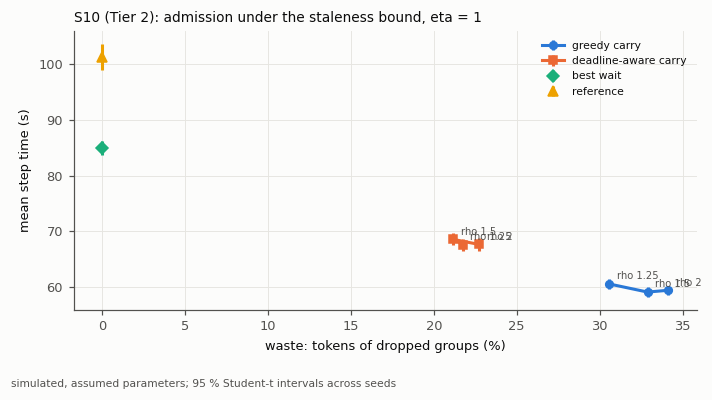

# Benchmarks

**Everything here is simulated, with assumed parameters** (`docs/simulator.md`). The numbers say how scheduling policies compare inside this model; they say nothing about production throughput or about learning quality (the simulator has no model of learning: staleness and length bias are measured quantities only).

## Reproduce

With the environment of the main README active, from the repository root:

```bash
python -m rollout_engine.bench tune --workers 4
python -m rollout_engine.bench --workers 4
python -m rollout_engine.bench microbench
python scripts/plot_results.py
python scripts/plot_timeline.py
python scripts/plot_framework.py
```

The first command regenerates `configs/tuned/tuned.json` (and the S7/S9 tuning tables) from the tuning seeds only; the committed file is the one the evaluation used, so it is needed only to check the tuning. The second runs the full evaluation into `benchmarks/results/full/` (`runs.csv`, `aggregate.csv`, `paired.csv`, `s7.csv`, `s9.csv`, `wall_*.csv`, `manifest.json`). `--quick` (3 seeds, 12 steps, fewer scenarios and policies) writes `benchmarks/results/quick/`. Workers default to half the logical processors (`--workers N` or `BENCH_WORKERS`); the committed results used 4 because the machine was shared with other jobs. Traces are generated into `outputs/traces/` (git-ignored) and replayed from those files; `configs/traces/sample.csv` is the small committed sample used by the tests and the demo.

The optional solver cross-check runs outside the result environment: `python scripts/solver_crosscheck.py` in an environment that has `highspy` and, optionally, a licensed `gurobipy`.

## Protocol

- **Seeds.** Tuning seeds 1000–1004; evaluation seeds 1–20 (10 for SENS); S7 and S9: 50 tuning instances (seeds 5000–5049) and 50 evaluation instances (6000–6049). A seed fixes the whole trace (prompts, lengths, estimates, verifier times), so every policy sees the same workload (common random numbers).
- **Objective.** `J` of `docs/contracts.md` section 4, normalized per cell by the reference policy's mean on the tuning seeds (`R_step`, `R_phase`). Weights 1, 0.5, 0.25, 1, 1 (closed loop) and 1, 0.5, 1 (single phase); in a cell where no policy differs from the reference by more than two standard errors of the paired difference on a term, that term's weight is 0 for every policy (`configs/tuned/tuned.json`, `term_check`). Every metric is reported, not only `J`.
- **Tuning.** Equal budget: every policy with tunable parameters gets 6 random configurations from its grid (the whole grid when smaller; search seed 2026), evaluated on the tuning seeds; the lowest mean `J` wins. Grids: `window_groups` {4, 8, 16, 32, 64}, `k0` {0.5, 1, 2, 4, 8}, `rho` {1.25, 1.5, 2} (where `rho` is not the varied dimension), `batch_size` {2, 4, 8, 16} (up to the batch cap), `kappa` {1.5, 2, 3, 4}, `deadline` {0.5, 1, 1.5, 2}. The **best S2 policy** (lowest tuned `J` in S2 heavy/group among deployable policies) fixes the other parts in S3–S6, S8, S10, and SENS ("vary one dimension at a time"). The tuned configuration was committed before the reported evaluation (`3310a8d`); an earlier evaluation led to a fix of the tuning procedure and was superseded (see Results). The result manifests record the commit.
- **Statistics.** Mean and 95 % Student-t interval across seeds; paired differences against the reference policy on the common seeds with their intervals; win/tie/loss counts with a 1 % relative tie band.
- **Checks on every run.** The accounting identities (check 4) and the staleness invariants (check 5) run on every simulated run of the evaluation; the manifest lists violations (there must be none).

## Scenarios

| Id | What varies | Fixed parts |
|---|---|---|
| S1 | static engine, one phase: batch formation `fifo_chunk`, `sorted_chunk`, `dp`, `oracle_dp` under estimate models none / group (error 0.5) / group (exact), batch caps 8 and 16 | 64 samples (8 groups of 8), one prompt length (512), 4 workers, heavy tail, `math` only |
| S2 | continuous engine, one phase: order (`fifo`, `longest_first`) × dispatch (`group`, `sample`) × binding (`early`, `late`) × assignment (`round_robin`, `least_loaded`, `lpt`, and `first_free` under late), `online_adaptive`, `online_eb` (Tier 2), `oracle_lpt`; light (log-sd 0.4) and heavy (1.1) tails × estimates none / group (error 0.3) | 64 groups of 8 on 8 workers, `math` only |
| S3 | closed loop, `eta` in {0, 1, 2, 4}: reference, best S2 + `wait`, best S2 + `carry(rho)`; at `eta = 1` the `inflight` modes `swap` and `interrupt` (the base cells use `drain`) | default system |
| S4 | stragglers at `eta = 2`: `wait`, `carry(rho)`, `abort(rho)`, `rho` in {1.25, 1.5, 2}, for the best S2 policy and for `online_adaptive` | default system |
| S5 | verifier: 4, 8, 16, 32 servers × orders `fifo`, `group_first`, `shortest_first` (best S2 + `wait`) | 70 % `code` tasks |
| S6 | partition of 16 GPUs: rollout GPUs 4, 6, 8, 10, 12 (the rest train) and colocated (switch 3 s), reference and best S2 + `wait` | `eta = 1` |
| S7 | exact references on small static instances: MILP optimum, DP, lower bound, gaps of `fifo_chunk`, `sorted_chunk`, `dp` with estimated and true lengths; MILP solve time against `n` | 8–16 samples, 2–3 workers, caps 4–6 |
| S8 (Tier 2) | distribution shift half way through the stream: none / tail heavier (log-sd × 1.3 after the shift, estimates keep the old calibration) / estimates degrade (error 0.3 → 1.2); reference, best S2, `online_adaptive`, `online_eb` with `wait` and with `abort(1.5)` / `abort_pred(1.5, kappa)` | `eta = 2` |
| S9 (Tier 2) | static plans made on estimates, replayed on the true lengths: MILP on estimates, scenario MILP with CVaR (`lam` tuned), the re-planning `dp` policy, against the clairvoyant optimum | S7 instances |
| S10 (Tier 2) | admission under the bound: greedy `carry(rho)` against deadline-aware `carry(rho)` for `rho` in {1.25, 1.5, 2}, plus `wait` and the reference | `eta = 1` |
| SENS | on S3 (`eta = 1`) and S4 (`rho = 1.5`): length tail × 0.75 and × 1.25, estimates none and error 1.0, training MFU 0.2 and 0.5 | 10 seeds |

Default system (`docs/simulator.md` section 9): 16 GPUs (8 rollout workers with `tp = 1`, 8 training), a 7.6 B-parameter model on 80 GB GPUs, `max_seqs` 32, `max_tokens` 8192, `B = 64` groups of 8 samples, `T = 24` steps (`warmup_steps = 2`), `eta = 1`, `drain`, 32 verifier servers, heavy tail with group estimates (error 0.3), 60 % `math` / 40 % `code`.

## Results

Evaluation of commit `3310a8d` (manifest: `benchmarks/results/full/manifest.json`): 5300 simulated runs, 0 accounting or staleness violations, 979 s on 4 worker processes (Intel Core i9-14900KF, 32 logical CPUs, 96 GiB, Windows 11, Python 3.12.3, NumPy 1.26.4, SciPy 1.13.1 with HiGHS 1.2.0). The machine was shared with other jobs (about 47 % CPU load in a 10 s sample taken before tuning; the load during the runs was not recorded), which affects only the wall-clock files. Tuning: 400 s (4 workers, per the run log). **A first evaluation (commit `777766d`) was superseded**: it exposed a flaw in the tuning procedure (the per-cell term check ran on default parameters only, so in S1 with batch cap 16 the phase-time term was dropped and the search then picked two-sample batches with a 75 % longer phase; the superseded files are kept outside the repository); the check now covers every configuration evaluated on the tuning seeds, and tuning and the whole evaluation were re-run.

Everything below is simulated, with assumed parameters; read every statement as "in this simulation, under these assumptions".


- **S1 (static batching, one phase).** With batch cap 8, `dp` on estimates shortens the phase from 60.0 s (reference: full FIFO batches) to 54.9–55.4 s when group estimates exist and does nothing without estimates (every sample then looks alike); `sorted_chunk` (tuned to 4-sample batches) lengthens it to about 69 s but lowers the padding from 53 % to 42 %; the oracle `dp` reaches 51.5 s. With cap 16 every full-batch policy runs one round of four batches, so the batch holding the longest sample sets the phase (58.5 s for reference and `dp`, 57.0 s for the oracle). J weighs padding as much as phase time here, so smaller batches rank well in J despite longer phases; the phase-time column is the one to read for speed.
- **S2 (continuous engine, one phase).** See the README; the table below lists all 31 policies of the heavy-tail, group-estimate cell. Light tail: the tuned best S2 policy is 9.7 % ± 5.4 % faster than the reference with estimates and 1.2 % ± 2.0 % without (10/6/4, the interval includes 0); the fastest policies in those cells, picked here after the fact (`longest_first+sample+late+first_free` and `fifo+sample+late+first_free`), reach 11.6 % and 3.4 %. The reference sits 58 % above the lower bound against 27 % for the oracle.
- **S3, S4, S10 (staleness, stragglers, admission).** `carry` is cheap from `eta = 2` on and wasteful at `eta <= 1` (dead groups); `abort` always throws away about a third of the generated tokens and biases the consumed lengths toward short responses by about −25 %; deadline-aware admission trades step time for less waste.
- **S5 (verifier).** (In the 8-server cell the step-time term of J has weight 0 because no policy moved it on the tuning seeds, so J ranks policies there by idle time and straggler delay.) At 4 and 8 servers verification is the bottleneck (trainer waiting 88–94 % of the time; step times 164–312 s for every policy); at 16 and 32 servers the best S2 policy is 11–16 % faster than the reference again (97.4 vs 110.0 s and 89.7 vs 106.3 s). `shortest_first` lowers the mean verifier delay by 12–25 % (most with few servers) without changing step times; `group_first` does not help.
- **S6 (partition).** Step time falls as rollout GPUs grow from 4 to 12 (reference 154.3 → 81.9 s); colocating all 16 GPUs costs 92–95 s per step with the assumed 3 s switches.
- **S7, S9 (exact references, risk).** The DP and the MILP agree with brute force in the tests; on the 50 evaluation instances the MILP was solved to optimality every time; see the tables.
- **SENS.** Every paired comparison is in `paired.csv` (`scenario = SENS`); the figure shows J differences against the reference per variation.




### Tables (generated by `scripts/plot_results.py`)

<!-- generated by scripts/plot_results.py from benchmarks/results; simulated, assumed parameters -->

**Closed loop** (mean ± 95 % CI across seeds; W/T/L = paired wins/ties/losses on J against the reference, tie band 1 %)

| Scenario | Policy | J | step time (s) | GPU idle | P95 straggler (s) | waste | length bias | staleness | W/T/L |
|---|---|---|---|---|---|---|---|---|---|
| S3 eta1 | best_s2+carry | 1.389 ± 0.013 | 59.2 ± 0.9 | 37 % ± 0 | 16.7 ± 1.3 | 33 % ± 0 | -24 % ± 0 | 0.98 ± 0.00 | 16/0/4 |
| S3 eta1 | best_s2+wait | 1.173 ± 0.025 | 84.9 ± 1.3 | 48 % ± 1 | 34.5 ± 4.2 | 0 % ± 0 | 0 % ± 0 | 1.00 ± 0.00 | 20/0/0 |
| S3 eta1 | reference | 1.466 ± 0.040 | 101.2 ± 2.4 | 58 % ± 1 | 65.6 ± 5.9 | 0 % ± 0 | 0 % ± 0 | 0.99 ± 0.00 | – |
| S3 eta0 | best_s2+carry | 1.667 ± 0.015 | 67.5 ± 0.8 | 50 % ± 0 | 13.6 ± 1.1 | 43 % ± 0 | -33 % ± 0 | 0.00 ± 0.00 | 0/0/20 |
| S3 eta0 | best_s2+wait | 1.327 ± 0.021 | 103.6 ± 1.2 | 57 % ± 0 | 33.6 ± 3.7 | 0 % ± 0 | 0 % ± 0 | 0.00 ± 0.00 | 18/2/0 |
| S3 eta0 | reference | 1.397 ± 0.019 | 107.3 ± 1.2 | 62 % ± 0 | 39.1 ± 3.7 | 0 % ± 0 | 0 % ± 0 | 0.00 ± 0.00 | – |
| S4 eta2 | best_s2+abort(1.25) | 1.435 ± 0.013 | 62.8 ± 0.8 | 38 % ± 0 | 16.6 ± 0.8 | 34 % ± 0 | -24 % ± 1 | 0.97 ± 0.00 | 11/4/5 |
| S4 eta2 | best_s2+abort(1.5) | 1.461 ± 0.010 | 62.2 ± 0.7 | 38 % ± 0 | 17.1 ± 0.9 | 36 % ± 0 | -25 % ± 1 | 0.97 ± 0.00 | 8/4/8 |
| S4 eta2 | best_s2+abort(2) | 1.469 ± 0.011 | 62.6 ± 0.9 | 38 % ± 0 | 17.0 ± 1.0 | 36 % ± 0 | -25 % ± 0 | 0.97 ± 0.00 | 7/3/10 |
| S4 eta2 | best_s2+carry(1.25) | 0.810 ± 0.011 | 60.0 ± 0.8 | 35 % ± 0 | 13.4 ± 1.0 | 0 % ± 0 | -0 % ± 0 | 0.89 ± 0.01 | 20/0/0 |
| S4 eta2 | best_s2+carry(1.5) | 0.699 ± 0.008 | 51.4 ± 0.7 | 32 % ± 0 | 7.2 ± 0.5 | 0 % ± 0 | -0 % ± 0 | 0.99 ± 0.01 | 20/0/0 |
| S4 eta2 | best_s2+carry(2) | 0.675 ± 0.007 | 47.9 ± 0.5 | 31 % ± 0 | 6.9 ± 0.7 | 2 % ± 0 | -1 % ± 0 | 1.19 ± 0.01 | 20/0/0 |
| S4 eta2 | best_s2+wait | 1.173 ± 0.025 | 84.9 ± 1.3 | 48 % ± 1 | 34.5 ± 4.2 | 0 % ± 0 | 0 % ± 0 | 1.00 ± 0.00 | 20/0/0 |
| S4 eta2 | online_adaptive+abort(1.25) | 1.439 ± 0.014 | 62.7 ± 0.7 | 38 % ± 0 | 17.2 ± 1.3 | 34 % ± 1 | -24 % ± 1 | 0.97 ± 0.00 | 10/4/6 |
| S4 eta2 | online_adaptive+abort(1.5) | 1.462 ± 0.012 | 62.2 ± 0.7 | 38 % ± 0 | 17.0 ± 0.9 | 36 % ± 0 | -25 % ± 0 | 0.97 ± 0.00 | 8/2/10 |
| S4 eta2 | online_adaptive+abort(2) | 1.476 ± 0.016 | 62.9 ± 0.8 | 38 % ± 0 | 18.1 ± 1.6 | 36 % ± 1 | -25 % ± 1 | 0.97 ± 0.00 | 8/1/11 |
| S4 eta2 | online_adaptive+carry(1.25) | 0.808 ± 0.010 | 60.1 ± 0.9 | 35 % ± 0 | 12.6 ± 0.9 | 0 % ± 0 | -0 % ± 0 | 0.89 ± 0.02 | 20/0/0 |
| S4 eta2 | online_adaptive+carry(1.5) | 0.701 ± 0.007 | 51.4 ± 0.6 | 32 % ± 0 | 7.4 ± 0.7 | 0 % ± 0 | -0 % ± 0 | 0.99 ± 0.01 | 20/0/0 |
| S4 eta2 | online_adaptive+carry(2) | 0.674 ± 0.007 | 47.8 ± 0.5 | 31 % ± 0 | 7.1 ± 0.7 | 2 % ± 0 | -1 % ± 0 | 1.19 ± 0.01 | 20/0/0 |
| S4 eta2 | online_adaptive+wait | 1.172 ± 0.026 | 84.9 ± 1.3 | 48 % ± 1 | 33.9 ± 4.2 | 0 % ± 0 | 0 % ± 0 | 1.00 ± 0.00 | 20/0/0 |
| S4 eta2 | reference | 1.466 ± 0.040 | 101.2 ± 2.4 | 58 % ± 1 | 65.6 ± 5.9 | 0 % ± 0 | 0 % ± 0 | 0.99 ± 0.00 | – |
| S5 servers8 | best_s2+v_fifo | 0.414 ± 0.008 | 164.6 ± 2.1 | 72 % ± 0 | 35.1 ± 4.4 | 0 % ± 0 | 0 % ± 0 | 1.00 ± 0.00 | 13/4/3 |
| S5 servers8 | best_s2+v_group_first | 0.427 ± 0.007 | 164.3 ± 1.9 | 72 % ± 0 | 44.0 ± 4.1 | 0 % ± 0 | 0 % ± 0 | 1.00 ± 0.00 | 6/5/9 |
| S5 servers8 | best_s2+v_shortest_first | 0.415 ± 0.008 | 164.7 ± 2.1 | 72 % ± 0 | 35.8 ± 4.3 | 0 % ± 0 | 0 % ± 0 | 1.00 ± 0.00 | 11/6/3 |
| S5 servers8 | reference | 0.422 ± 0.007 | 163.7 ± 1.9 | 73 % ± 0 | 37.1 ± 3.9 | 0 % ± 0 | 0 % ± 0 | 0.99 ± 0.00 | – |
| S6 colocated | best_s2+wait | 1.175 ± 0.023 | 92.1 ± 1.2 | 23 % ± 1 | 33.3 ± 3.3 | 0 % ± 0 | 0 % ± 0 | 0.00 ± 0.00 | 20/0/0 |
| S6 colocated | reference | 1.272 ± 0.020 | 94.8 ± 0.9 | 35 % ± 1 | 36.0 ± 3.7 | 0 % ± 0 | 0 % ± 0 | 0.00 ± 0.00 | – |

**One phase, S2 heavy tail with group estimates** (every policy)

| Policy | J | phase time (s) | gap to lower bound | GPU idle | W/T/L |
|---|---|---|---|---|---|
| oracle_lpt | 0.863 ± 0.009 | 68.9 ± 1.2 | 11 % ± 1 | 7 % ± 4 | 20/0/0 |
| longest_first+sample+late+round_robin | 0.924 ± 0.020 | 70.9 ± 1.8 | 14 % ± 2 | 14 % ± 4 | 19/0/1 |
| online_eb | 0.924 ± 0.020 | 70.9 ± 1.8 | 14 % ± 2 | 14 % ± 4 | 19/0/1 |
| online_adaptive | 0.925 ± 0.020 | 70.9 ± 1.8 | 14 % ± 2 | 14 % ± 4 | 19/0/1 |
| longest_first+sample+late+least_loaded | 0.925 ± 0.020 | 70.9 ± 1.8 | 14 % ± 2 | 14 % ± 4 | 19/0/1 |
| longest_first+sample+late+lpt | 0.925 ± 0.020 | 70.9 ± 1.8 | 14 % ± 2 | 14 % ± 4 | 19/0/1 |
| fifo+sample+early+lpt | 0.930 ± 0.025 | 71.3 ± 1.9 | 14 % ± 2 | 15 % ± 4 | 18/1/1 |
| longest_first+sample+early+lpt | 0.930 ± 0.025 | 71.3 ± 1.9 | 14 % ± 2 | 15 % ± 4 | 18/1/1 |
| longest_first+sample+early+least_loaded | 0.932 ± 0.025 | 71.4 ± 2.0 | 14 % ± 2 | 15 % ± 4 | 18/1/1 |
| longest_first+sample+early+round_robin | 0.932 ± 0.025 | 71.4 ± 2.0 | 14 % ± 2 | 15 % ± 4 | 18/1/1 |
| longest_first+group+late+least_loaded | 0.952 ± 0.019 | 70.9 ± 1.8 | 14 % ± 2 | 20 % ± 4 | 18/1/1 |
| fifo+group+early+lpt | 0.953 ± 0.022 | 70.9 ± 1.9 | 14 % ± 2 | 20 % ± 4 | 18/0/2 |
| longest_first+group+early+least_loaded | 0.953 ± 0.022 | 70.9 ± 1.9 | 14 % ± 2 | 20 % ± 4 | 18/0/2 |
| longest_first+group+early+lpt | 0.953 ± 0.022 | 70.9 ± 1.9 | 14 % ± 2 | 20 % ± 4 | 18/0/2 |
| longest_first+group+late+lpt | 0.958 ± 0.018 | 71.2 ± 1.9 | 14 % ± 2 | 20 % ± 3 | 19/0/1 |
| longest_first+group+late+round_robin | 0.968 ± 0.023 | 71.4 ± 2.0 | 15 % ± 2 | 22 % ± 4 | 18/1/1 |
| longest_first+group+early+round_robin | 0.974 ± 0.022 | 71.8 ± 1.9 | 15 % ± 2 | 22 % ± 4 | 18/1/1 |
| fifo+sample+early+least_loaded | 0.981 ± 0.018 | 75.1 ± 2.1 | 21 % ± 3 | 16 % ± 3 | 18/0/2 |
| fifo+sample+early+round_robin | 0.981 ± 0.018 | 75.1 ± 2.1 | 21 % ± 3 | 16 % ± 3 | 18/0/2 |
| fifo+sample+late+first_free | 0.985 ± 0.017 | 74.5 ± 2.1 | 20 % ± 3 | 18 % ± 3 | 16/1/3 |
| fifo+sample+late+least_loaded | 0.988 ± 0.020 | 74.8 ± 2.1 | 20 % ± 3 | 18 % ± 3 | 18/2/0 |
| fifo+sample+late+round_robin | 0.989 ± 0.021 | 74.9 ± 2.1 | 20 % ± 3 | 18 % ± 3 | 18/0/2 |
| fifo+sample+late+lpt | 0.989 ± 0.020 | 74.9 ± 2.1 | 20 % ± 2 | 18 % ± 3 | 18/2/0 |
| longest_first+sample+late+first_free | 0.998 ± 0.020 | 73.9 ± 2.2 | 19 % ± 3 | 22 % ± 3 | 13/4/3 |
| longest_first+group+late+first_free | 1.016 ± 0.034 | 73.2 ± 2.4 | 17 % ± 3 | 27 % ± 5 | 13/2/5 |
| fifo+group+early+least_loaded | 1.031 ± 0.034 | 76.0 ± 2.8 | 22 % ± 4 | 23 % ± 3 | 14/2/4 |
| fifo+group+late+first_free | 1.042 ± 0.037 | 76.5 ± 2.7 | 23 % ± 4 | 25 % ± 4 | 14/2/4 |
| fifo+group+late+least_loaded | 1.047 ± 0.032 | 76.9 ± 2.8 | 23 % ± 4 | 25 % ± 3 | 14/1/5 |
| fifo+group+late+lpt | 1.056 ± 0.037 | 77.3 ± 2.9 | 24 % ± 4 | 25 % ± 3 | 12/3/5 |
| fifo+group+late+round_robin | 1.058 ± 0.030 | 77.3 ± 2.6 | 24 % ± 3 | 26 % ± 3 | 13/1/6 |
| reference | 1.091 ± 0.048 | 78.6 ± 3.3 | 26 % ± 5 | 29 % ± 4 | – |

**S8 (Tier 2): distribution shift half way through the stream** (eta = 2; J is normalized within each shift cell, so compare J within a cell; step-time change = relative to the same policy without shift)

| Shift | Policy | J | step-time change | step time (s) | waste | length bias |
|---|---|---|---|---|---|---|
| none | online_eb+abort_pred(1.5) | 0.701 ± 0.006 | – | 51.3 ± 0.5 | 0 % ± 0 | -1 % ± 0 |
| none | online_adaptive+wait | 1.172 ± 0.026 | – | 84.9 ± 1.3 | 0 % ± 0 | 0 % ± 0 |
| none | online_eb+wait | 1.173 ± 0.025 | – | 84.9 ± 1.3 | 0 % ± 0 | 0 % ± 0 |
| none | best_s2+wait | 1.173 ± 0.025 | – | 84.9 ± 1.3 | 0 % ± 0 | 0 % ± 0 |
| none | best_s2+abort(1.5) | 1.461 ± 0.010 | – | 62.2 ± 0.7 | 36 % ± 0 | -25 % ± 1 |
| none | online_adaptive+abort(1.5) | 1.462 ± 0.012 | – | 62.2 ± 0.7 | 36 % ± 0 | -25 % ± 0 |
| none | reference | 1.466 ± 0.040 | – | 101.2 ± 2.4 | 0 % ± 0 | 0 % ± 0 |
| estimates_degrade | online_eb+abort_pred(1.5) | 0.703 ± 0.007 | -0.3 % | 51.2 ± 0.5 | 1 % ± 0 | -1 % ± 0 |
| estimates_degrade | online_adaptive+wait | 1.172 ± 0.025 | -0.1 % | 84.9 ± 1.3 | 0 % ± 0 | 0 % ± 0 |
| estimates_degrade | online_eb+wait | 1.173 ± 0.025 | -0.1 % | 84.9 ± 1.2 | 0 % ± 0 | 0 % ± 0 |
| estimates_degrade | best_s2+wait | 1.174 ± 0.025 | -0.0 % | 84.8 ± 1.3 | 0 % ± 0 | 0 % ± 0 |
| estimates_degrade | best_s2+abort(1.5) | 1.462 ± 0.011 | +0.2 % | 62.3 ± 0.7 | 36 % ± 0 | -25 % ± 1 |
| estimates_degrade | reference | 1.466 ± 0.040 | +0.0 % | 101.2 ± 2.4 | 0 % ± 0 | 0 % ± 0 |
| estimates_degrade | online_adaptive+abort(1.5) | 1.469 ± 0.009 | -0.0 % | 62.2 ± 0.7 | 36 % ± 0 | -26 % ± 0 |
| tail_heavier | online_eb+abort_pred(1.5) | 0.724 ± 0.008 | +13.6 % | 58.3 ± 0.6 | 0 % ± 0 | -0 % ± 0 |
| tail_heavier | best_s2+wait | 1.127 ± 0.023 | +5.6 % | 89.7 ± 1.2 | 0 % ± 0 | 0 % ± 0 |
| tail_heavier | online_eb+wait | 1.127 ± 0.023 | +5.7 % | 89.7 ± 1.2 | 0 % ± 0 | 0 % ± 0 |
| tail_heavier | online_adaptive+wait | 1.127 ± 0.023 | +5.7 % | 89.8 ± 1.2 | 0 % ± 0 | 0 % ± 0 |
| tail_heavier | reference | 1.444 ± 0.039 | +8.2 % | 109.5 ± 3.0 | 0 % ± 0 | 0 % ± 0 |
| tail_heavier | online_adaptive+abort(1.5) | 1.532 ± 0.009 | +17.5 % | 73.1 ± 0.7 | 37 % ± 0 | -26 % ± 0 |
| tail_heavier | best_s2+abort(1.5) | 1.535 ± 0.011 | +17.7 % | 73.2 ± 0.5 | 38 % ± 1 | -26 % ± 1 |

**S6 partition planning**: the GPU split with the lowest mean step time, per policy (16 GPUs)

| Policy | best split | its step time (s) | colocated step time (s) |
|---|---|---|---|
| best_s2+wait | 12 rollout + 4 training GPUs | 78.7 ± 1.2 | 92.1 ± 1.2 |
| reference | 12 rollout + 4 training GPUs | 81.9 ± 0.9 | 94.8 ± 0.9 |

**S9 (Tier 2): static plans made on estimates, replayed on the true lengths** (50 evaluation instances)

| Plan | mean realized makespan / optimum | worst |
|---|---|---|
| MILP on estimates | 1.120 | 1.959 |
| dp policy (re-plans) | 1.063 | 1.294 |
| scenario CVaR, lam 0 (tuned) | 1.033 | 1.409 |
| scenario CVaR, lam 0.5 | 1.042 | 1.532 |
| scenario CVaR, lam 1 | 1.047 | 1.686 |
| scenario CVaR, lam 2 | 1.050 | 1.686 |

**S7 exact references** (50 evaluation instances; statuses: ['optimal'])

| Plan | mean gap to the MILP optimum | worst gap |
|---|---|---|
| fifo_chunk | 12.1 % | 52.1 % |
| sorted_chunk | 6.6 % | 10.7 % |
| dp | 6.3 % | 29.4 % |
| sorted_chunk_oracle | 6.5 % | 10.7 % |
| oracle_dp | 6.1 % | 10.7 % |

### Solver cross-check (Tier 2, optional)

`benchmarks/results/solver_crosscheck.md`: SciPy's HiGHS 1.2.0, `highspy` 1.15.1, and Gurobi 12.0.2 (one thread) agree on all 50 S7 optima; on the sweep instance (seed 8000) all three prove n = 128, 192, 256 (Gurobi fastest); nothing in the results above depends on the other two solvers.

### Decision cost

`benchmarks/results/wall_decision_cost.csv` (wall clock, minimum of 5 repetitions, run on the final code with other jobs at about 61 % CPU load in a sample taken just before; process CPU time on Windows has a 15.6 ms resolution, so small values read 0): one policy invocation of the reference takes 0.04 / 0.53 / 22.5 ms with 64 / 512 / 4096 pending samples; `longest_first+sample+late+lpt` 0.55 / 2.6 / 7.6 ms (late binding places only what fits now); `online_adaptive` 0.56 / 2.7 / 7.0 ms; the static `dp` policy 0.9 / 8.8 / 91 ms; the DP alone 0.5 / 4.9 / 43 ms; the S7 MILP with 3 workers 35 ms (16 samples) and about 0.7 s (32 and 64 samples).

## TODO

- More tuning seeds (today 5; the term check can drop a term whose effect is small on 5 seeds).
- A wall-clock benchmark of the live service (today only its conformance with the simulator is tested).
- Calibrated engine parameters and public length data (today assumed parameters and synthetic lengths; see the README).
- The S7 sweep stops at the first size with a capped solve (128 samples with HiGHS 1.2.0 and a 30 s cap); the cross-check (seed 8000 only) has all three solvers, SciPy's included, prove n = 128–256 within 25 s; the seeds capped in the sweep were not cross-checked.
